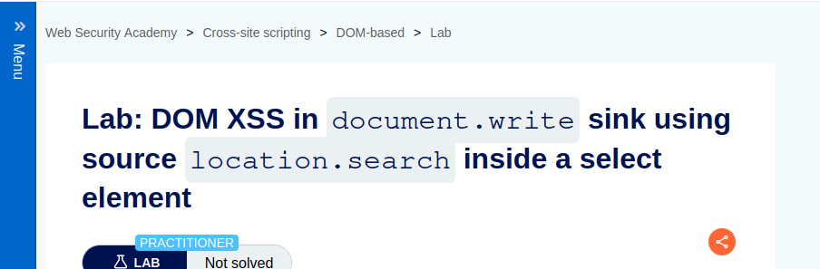

Lab: DOM XSS in document.write sink using source location.search inside a select element

Solution: 

    1. On the product pages, notice that the dangerous JavaScript extracts a storeId parameter from the location.search source. It then uses document.write to create a new option in the select element for the stock checker functionality.
    
    2. Add a storeId query parameter to the URL and enter a random alphanumeric string as its value. Request this modified URL.
    
    3. In the browser, notice that your random string is now listed as one of the options in the drop-down list.
    
    4. Right-click and inspect the drop-down list to confirm that the value of your storeId parameter has been placed inside a select element.

    5. Change the URL to include a suitable XSS payload inside the storeId parameter as follows:
    
    product?productId=1&storeId="></select>

