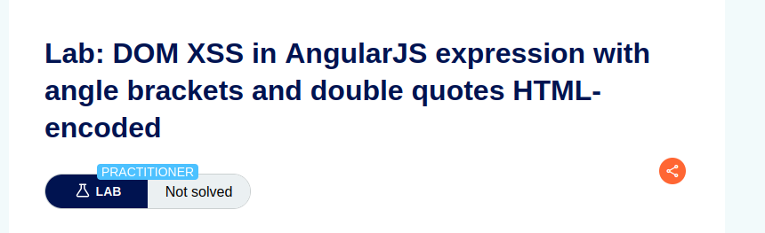

Lab: DOM XSS in AngularJS expression with angle brackets and double quotes HTML-encoded

Solution: 

    1. Enter a random alphanumeric string into the search box.
    
    2. View the page source and observe that your random string is enclosed in an ng-app directive.

    3. Enter the following AngularJS expression in the search box:
    {{$on.constructor('alert(1)')()}}
    
    4. Click search.

