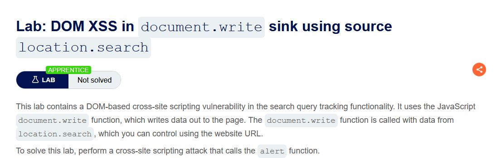
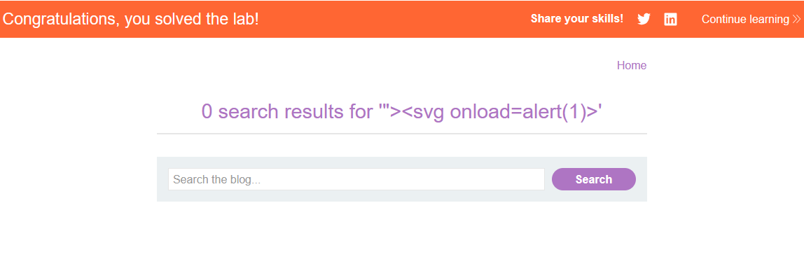

 

Lab: DOM XSS in document.write sink using source location.search

Solution: 
    
    1. Enter a random alphanumeric string into the search box.
    
    2. Right-click and inspect the element, and observe that your random string has been placed inside an img src attribute.

    3. Break out of the img attribute by searching for:
    "><svg onload=alert(1)>

  
