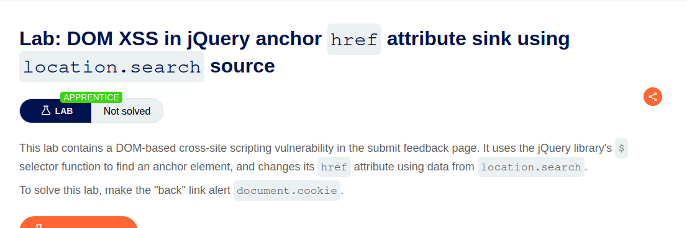
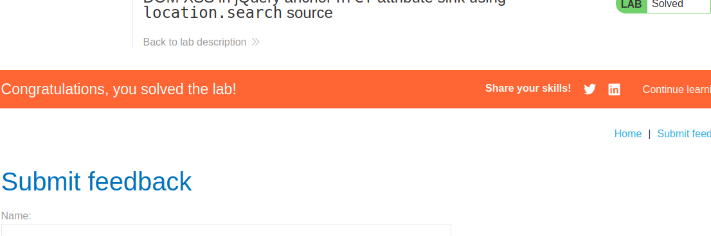

 

DOM XSS in jQuery anchor href attribute sink using location.search source

Solution: 

    1. On the Submit feedback page, change the query parameter returnPath to / followed by a random alphanumeric string.
    2. Right-click and inspect the element, and observe that your random string has been placed inside an a href attribute.

    3. Change returnPath to:
    javascript:alert(document.cookie)

    Hit enter and click "back".

