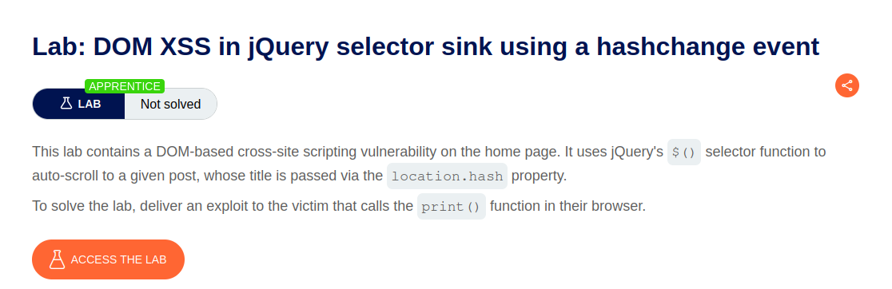
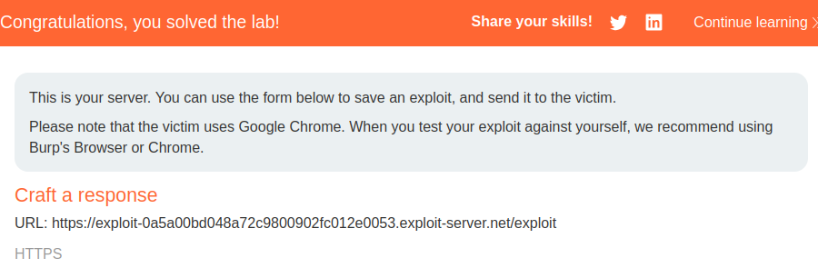

 

Lab: DOM XSS in jQuery selector sink using a hashchange event

Solution:  

    1. Notice the vulnerable code on the home page using Burp or the browser's DevTools.
    2. From the lab banner, open the exploit server.

    3. In the Body section, add the following malicious iframe:
    <iframe src="https://YOUR-LAB-ID.web-security-academy.net/#" onload="this.src+=''"></iframe>
    
    4. Store the exploit, then click View exploit to confirm that the print() function is called.
    
    5. Go back to the exploit server and click Deliver to victim to solve the lab.

