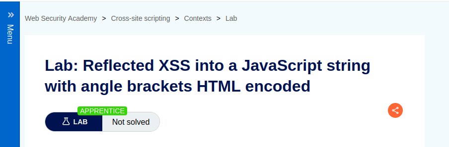
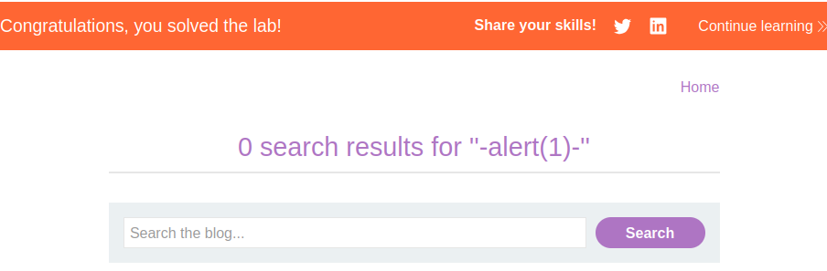

Lab: Reflected XSS into a JavaScript string with angle brackets HTML encoded

Solution:

    1. Submit a random alphanumeric string in the search box, then use Burp Suite to intercept the search request and send it to Burp Repeater.
    
    2. Observe that the random string has been reflected inside a JavaScript string.

    3. Replace your input with the following payload to break out of the JavaScript string and inject an alert:
    '-alert(1)-'
    
    4. Verify the technique worked by right clicking, selecting "Copy URL", and pasting the URL in the browser. When you load the page it should trigger an alert.

Random string inserted

