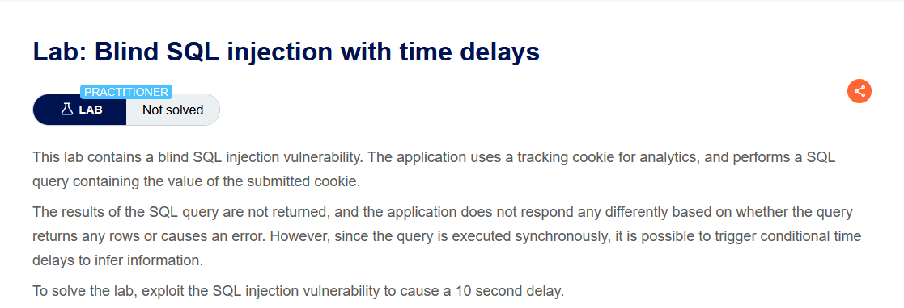
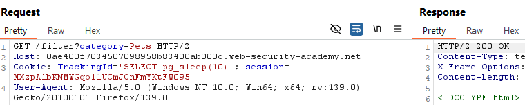
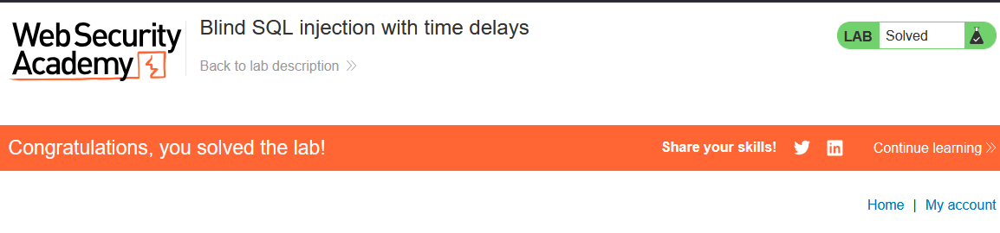

 

Lab: Blind SQL injection with time delays

Solution: 

    1. Visit the front page of the shop, and use Burp Suite to intercept and modify the request containing the TrackingId cookie.

    2. Modify the TrackingId cookie, changing it to:
    TrackingId=x'||pg_sleep(10)--
    
    3. Submit the request and observe that the application takes 10 seconds to respond.

Step to solve: [Before solving the lab use foxyproxy extension and add Burp Suite proxy]

    1. Open Burp Suite and access the LAB.
    2. Connect the proxy and turn on intercept.
    3. Now select a catergory and reload the page then send the request to the repeater and turn off intercept.
    4. Use the cheat sheet to find the payload and run it in trackingid value send it then copy the url and paste it. 

