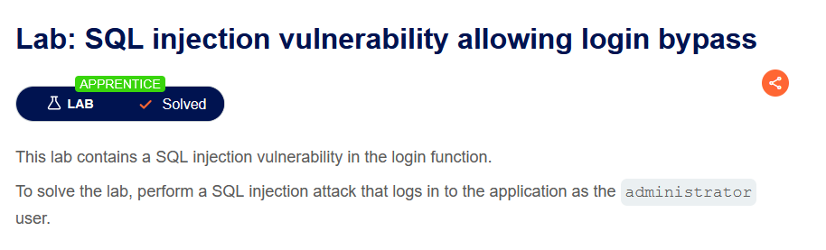
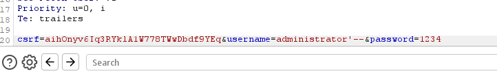
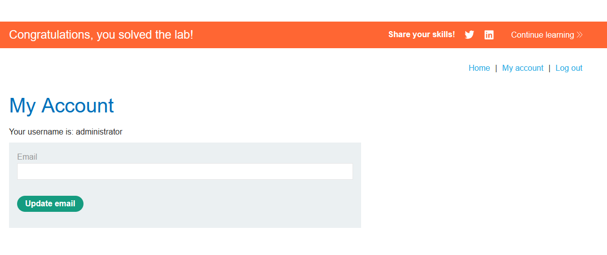

LAB: SQL injection vulnerability allowing login bypass

Solution: 
        
    1. Use Burp Suite to intercept and modify the login request.
    2. Modify the username parameter, giving it the value: administrator'--

Steps to Solve: [Before solving the lab use foxyproxy extension and add Burp Suite proxy]

    1. Open Burp Suite and access the LAB. 
    2. Connect the proxy and turn on intercept.
    3. Go to My account option and login with the name "administrator" and a random password. 
    4. Click log in then use '-- with administrator to bypass the password.(forward and turn off intercept)

    

    The lab is solved
    
