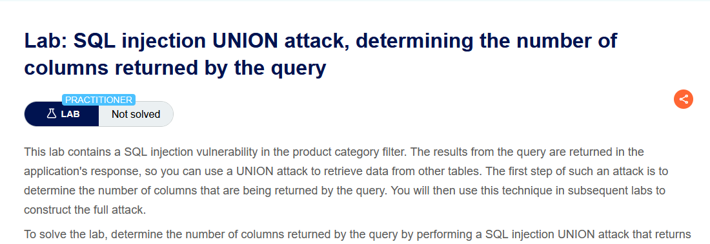
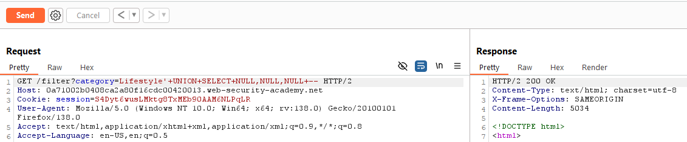
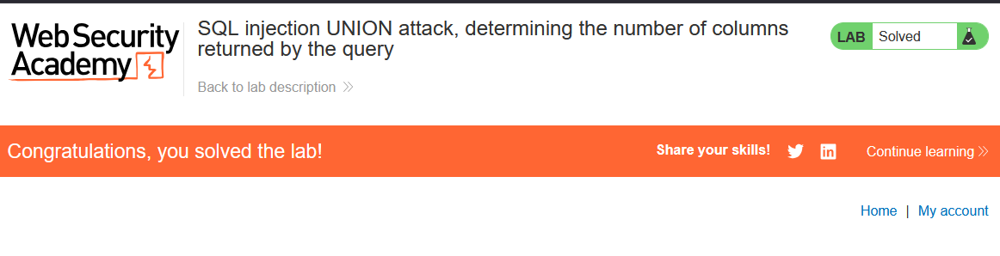

Lab: SQL injection UNION attack, determining the number of columns returned by the query

Solution: 
    
    1. Use Burp Suite to intercept and modify the request that sets the product category filter.

    2. Modify the category parameter, giving it the value '+UNION+SELECT+NULL--. Observe that an error occurs.

    3. Modify the category parameter to add an additional column containing a null value:
    '+UNION+SELECT+NULL,NULL--

    4. Continue adding null values until the error disappears and the response includes additional content containing the null values.

Step to solve: [Before solving the lab use foxyproxy extension and add Burp Suite proxy]

    1. Open Burp Suite and access the LAB.
    2. Connect the proxy and turn on intercept.
    3. Now select a catergory and reload the page then send the request to the repeater and turn off intercept.
    4. Use this query '+UNION+SELECT+NULL-- 
        if it gives internal error keep adding null until the request is successful. 

    5. Copy the url and paste it in a new tab. 

