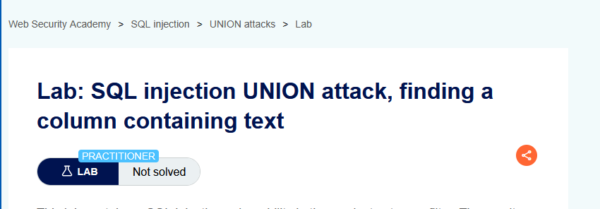
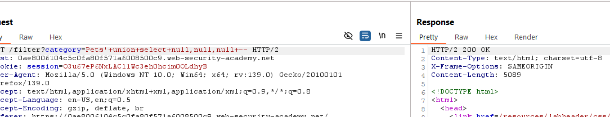
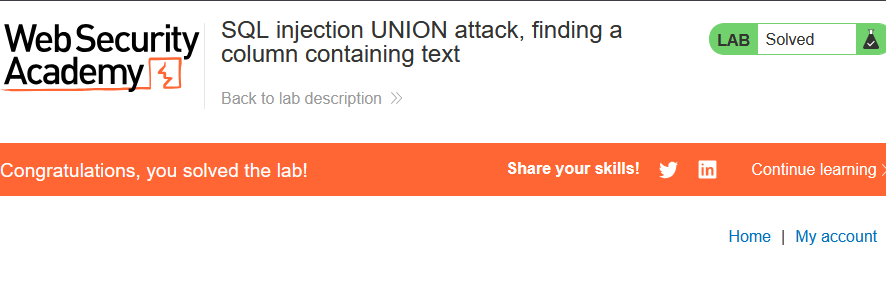
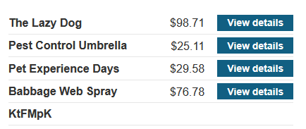

Lab: SQL injection UNION attack, finding a column containing text

Solution: 
    
    1. Use Burp Suite to intercept and modify the request that sets the product category filter.

    2. Determine the number of columns that are being returned by the query. Verify that the query is returning three columns, using the following payload in the category parameter:
    '+UNION+SELECT+NULL,NULL,NULL--

    3. Try replacing each null with the random value provided by the lab, for example:
    '+UNION+SELECT+'abcdef',NULL,NULL--

    4. If an error occurs, move on to the next null and try that instead.

Step to solve: [Before solving the lab use foxyproxy extension and add Burp Suite proxy]

    1. Open Burp Suite and access the LAB.
    2. Connect the proxy and turn on intercept.
    3. Now select a catergory and reload the page then send the request to the repeater and turn off intercept.
    4. Use this query '+UNION+SELECT+NULL-- 
        if it gives internal error keep adding null until the request is successful. 

    5. Copy the url and paste it. You will get a random string value copy it and replace with the null in the query. See which column reflect that value.  
        '+union+select+'KtFMpK',null,null+--
        '+union+select+null,'KtFMpK',null+--
        '+union+select+null,null,'KtFMpK'+--
    copy the url now and paste it. 

