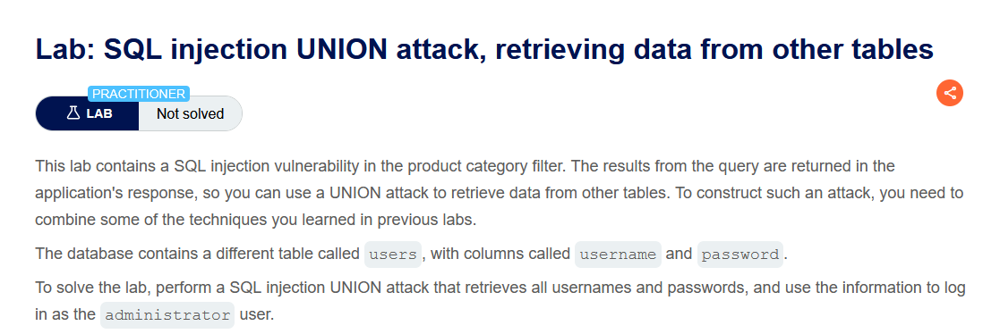
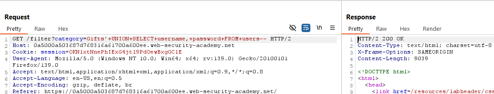
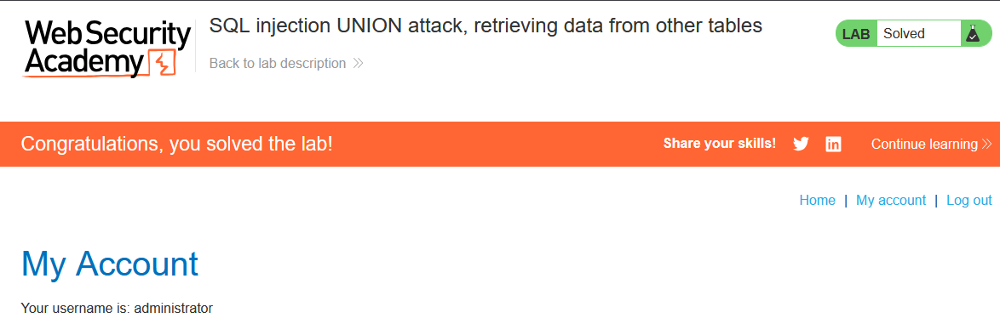

 

Lab: SQL injection UNION attack, retrieving data from other tables

Solution:

    1. Use Burp Suite to intercept and modify the request that sets the product category filter.

    2. Determine the number of columns that are being returned by the query and which columns contain text data. Verify that the query is returning two columns, both of which contain text, using a payload like the following in the category parameter:
    '+UNION+SELECT+'abc','def'--

    3. Use the following payload to retrieve the contents of the users table:
    '+UNION+SELECT+username,+password+FROM+users--

    4. Verify that the application's response contains usernames and passwords.

Step to solve: [Before solving the lab use foxyproxy extension and add Burp Suite proxy]

    1. Open Burp Suite and access the LAB.
    2. Connect the proxy and turn on intercept.
    3. Now select a catergory and reload the page then send the request to the repeater and turn off intercept.
    4. Now run this query 
        '+UNION+SELECT+username,+password+FROM+users--

        Copy the url and paste it. You will get administrator password and username. Use this to log in. 

