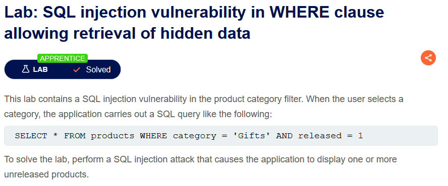
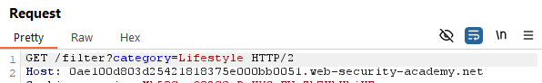
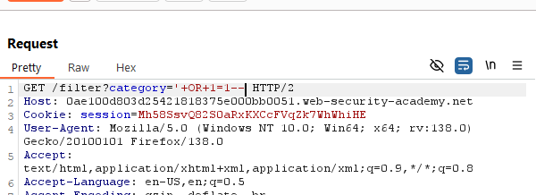
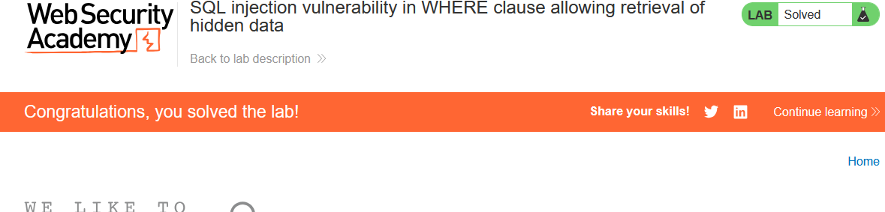

LAB: SQL injection vulnerability in WHERE clause allowing retrieval of hidden data

Solution : 
            
    1. Use Burp Suite to intercept and modify the request that sets the product category filter.
    2. Modify the category parameter, giving it the value '+OR+1=1--
    3. Submit the request, and verify that the response now contains one or more unreleased products.

Steps to Solve: [Before solving the lab use foxyproxy extension and add Burp Suite proxy]

    1. Open Burp Suite and access the LAB. 
    2. Connect the proxy and turn on intercept.(a reload of the page is needed)
    3. Choose a category then send that request to the repeater, turn off intercept and modify the request. 
    4. Replace the value 
        
        
        After changing the value with '+OR+1=1--
        
    5. Send it and go back to the page it should be solved. 
        